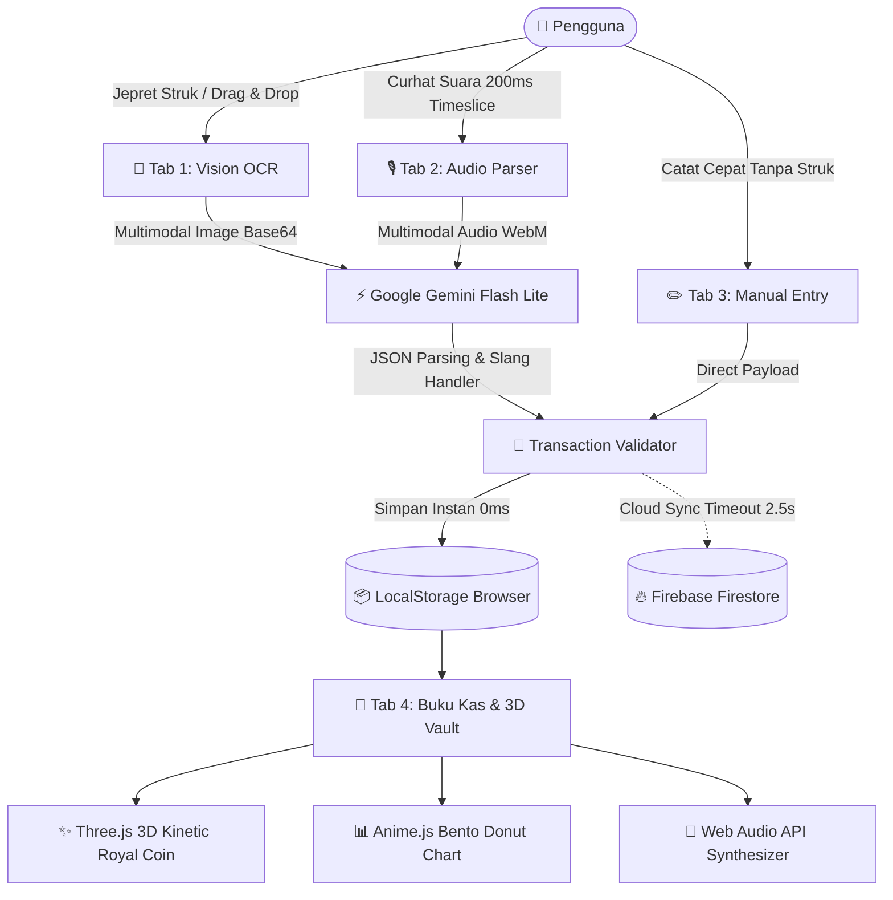

# 🪙 Memony — AI Tactile Expense & Receipt Memory Ledger
> *"Every Penny Tells a Story — Mengabadikan Jejak Keuangan dengan Sentuhan Kecerdasan Buatan & Estetika Meja Pos Klasik."*

[](LICENSE)
[](https://aistudio.google.com/)
[](https://firebase.google.com/)
[](https://web.dev/progressive-web-apps/)

---

## 📖 1. Latar Belakang & Filosofi "Memony"
**Memony** adalah singkatan dari **Memory + Money**.

Dalam kehidupan sehari-hari siswa Rekayasa Perangkat Lunak (RPL), pengeluaran bukan sekadar deretan angka kering yang berkurang dari dompet. Di balik setiap rupiah yang dibelanjakan, ada **memori dan cerita berharga**:
- 🍜 Semangkuk mie ayam hangat sepulang sekolah bersama teman sekelas.
- 📚 Buku catatan berpetak dan pulpen baru untuk merancang diagram logika & algoritma.
- ☕ Kopi susu gula aren saat maraton ngoding project larut malam.
- 🛵 Bensin dan ongkos perjalanan harian.

Seringkali kita malas mencatat keuangan karena aplikasi kas yang ada terasa membosankan, rumit, dan menuntut pengetikan manual satu per satu. **Memony hadir untuk mengubah itu semua**: cukup jepret foto struk belanjaan atau curhat lewat rekaman suara, dan AI akan merapikan seluruh memorinya ke dalam buku kas kerajaan yang megah!

---

## 👨‍💻 2. Pengembang
Dikembangkan oleh **Chandra** ([@channdraa-afk](https://github.com/channdraa-afk)) — Pelajar Rekayasa Perangkat Lunak (RPL).

---

## 🏛️ 3. Fitur-Fitur

### 📸 1. The Vision Receipt Scanner (Jepret & Drag-Drop Struk)
- Didukung oleh model **Google Gemini Flash Lite**.
- Memindai foto struk belanjaan (Indomaret, Alfamart, kafe, SPBU, bon warung makan, dsb.) dalam waktu **~1 detik**.
- Fitur **Drag and Drop** langsung ke dropzone atau klik untuk upload kamera.
- Mengekstrak nama merchant, tanggal transaksi, kategori, rincian barang per item beserta harganya, pajak, diskon, dan total belanjaan.
- Dilengkapi animasi **Laser Scanner Beam** bercahaya lembut saat proses pemindaian berlangsung.

### 🎙️ 2. Quick Voice Expense (Curhat Suara Taktil)
- Perekam suara taktil berbasis *MediaRecorder API* dengan *timeslice chunking* 200ms & *AudioContext Live Wave Meter*.
- Bar gelombang suara menari secara dinamis mengikuti kekuatan suara vokal mikrofon.
- Kamu cukup berbicara santai (contoh: *"Beli es teh 4 ribu sama siomay 10 ribu"*), dan AI langsung membedah ucapanmu menjadi data transaksi terstruktur tanpa batas kuota berlebih (1.500 req/hari).

### 📊 3. Bento Stats Grid & Interactive Donut Chart
- **Budget Progress Ring**: Melacak persentase sisa anggaran bulanan dengan bar indikator dinamis.
- **SVG Donut Chart**: Visualisasi interaktif proporsi pengeluaran (Makanan, Belanja, Transportasi, RPL, Hiburan) dengan animasi pegas bertenaga `Anime.js`.

### 🔔 4. Tactile Audio Synthesizer (Web Audio API)
- Suara koin emas gemerincing murni (*dual harmonic sine waves*).
- Bel kasir antik (*"Kaching! 🔔"*).
- Cap stempel lilin (*wax seal press thump*).
- Dilengkapi tombol *Mute Toggle* untuk kenyamanan di ruang publik.

### 📱 5. PWA Standalone Ready (Mobile & Desktop)
- Mendukung *Progressive Web App (PWA)*.
- Dapat diinstal di layar utama smartphone (*Add to Home Screen*) dan langsung mengakses kamera ponsel layaknya aplikasi native.

### 🔄 6. Dual-Engine Storage (Cloud + Offline First)
- **LocalStorage Master**: Transaksi disimpan detik itu juga secara lokal (*0ms instant reactive*), menjamin aplikasi 100% berfungsi penuh tanpa internet maupun tanpa akun cloud.
- **Cloud Firestore (Opsional)**: Mendukung sinkronisasi *real-time* multi-perangkat antar HP dan laptop dengan proteksi *timeout* 2.5 detik.

---

## 🏗️ 4. Arsitektur Sistem (Dual-Engine Pipeline)



---

## 🛡️ 5. Protokol Keamanan & Zero-Leak Policy (Public Safe)

Project ini mematuhi standar *Zero Credential Leak*:
1. 🔒 **Bebas dari Kunci API Hardcoded**:
   - Seluruh kredensial API telah dilepas dari kode sumber.
   - Pengguna dapat memasukkan **Google Gemini API Key** langsung melalui **Modal Pengaturan (⚙️)** di antarmuka web, yang tersimpan terisolasi di `LocalStorage` browser pribadi.
2. 🛡️ **Proteksi GitIgnore Mutlak**:
   - Berkas `config.local.js` dan file `.env` otomatis dikecualikan dari Git melalui `.gitignore`. Repositori ini **100% aman untuk dipublikasikan sebagai Public Repo di GitHub**.
3. 🧱 **Kebal SQL Injection & XSS**:
   - Menggunakan format objek terstruktur dengan sanitasi teks HTML semantik sebelum dirender ke DOM.

---

## 📂 6. Struktur Berkas Proyek

```
memony/
│
├── .gitignore              # Proteksi berkas privat agar tidak ter-push ke GitHub
├── firebase.json           # Konfigurasi hosting & cloud rules Firebase
├── firestore.rules         # Aturan keamanan database Cloud Firestore
├── package.json            # Script lokal & metadata project
├── README.md               # Dokumentasi mahakarya project
│
└── src/
    ├── index.html          # Layout semantik utama (Tabs navigation, Nunito font)
    ├── styles.css          # Desain Warm Studio Modern, tactile shadow, kinetic UI
    ├── app.js              # Controller utama aplikasi & tab orchestrator
    ├── gemini-service.js   # Integrasi Google Gemini Flash Lite REST API
    ├── firebase-service.js # Integrasi Firestore real-time & Cloud Sync
    ├── storage-service.js  # Penyimpanan lokal offline-first & ekspor CSV/JSON
    ├── coin-3d-service.js  # Visualisasi koin emas 3D kinetik Three.js
    ├── audio-service.js    # Synthesizer efek audio taktil murni (Web Audio API)
    ├── chart-service.js    # Visualisasi donat SVG & legenda kategori
    ├── manifest.json       # PWA manifest untuk Android/iOS install
    ├── sw.js               # Service Worker untuk offline caching
    ├── config.example.js   # Template konfigurasi publik aman untuk GitHub
    └── assets/
        └── icon.svg        # Ikon resmi segel stempel emas Memony
```

---

## ⚡ 7. Panduan Menjalankan

### A. Menjalankan Secara Lokal di Komputer:
```bash
git clone https://github.com/channdraa-afk/memony.git
cd memony

# Menjalankan server lokal ringan
npm start
# Buka http://localhost:3000 di browsermu
```

### B. Konfigurasi Kunci API AI:
1. Buka aplikasi di browser (`http://localhost:3000`).
2. Klik ikon **Pengaturan (⚙️)** di pojok kanan atas.
3. Tempel **Google Gemini API Key** milikmu (tersimpan aman di `LocalStorage` pribadi).
4. Selesai! Fitur OCR Struk dan Curhat Suara langsung aktif.

### C. Deploy ke Firebase Hosting (Live Demo):
```bash
npm run deploy
# Aplikasi akan langsung LIVE di https://<project-id>.web.app
```

---

## 🗺️ 7. Roadmap Masa Depan
- [x] V1.0: AI Receipt OCR dengan Gemini 3.6 Flash & Audio Synthesizer Taktil.
- [x] V1.0: Realtime Cloud Firestore Sync & Offline Cache.
- [x] V1.0: PWA Standalone Mobile Support & Ekspor Data CSV/JSON.
- [ ] V1.1: Multi-Currency & Nilai Tukar Otomatis.
- [ ] V1.2: The Royal Treasurer Monthly AI Financial Review Report.

---

*Dibuat oleh **Chandra (@channdraa-afk)** 🪙📜*
